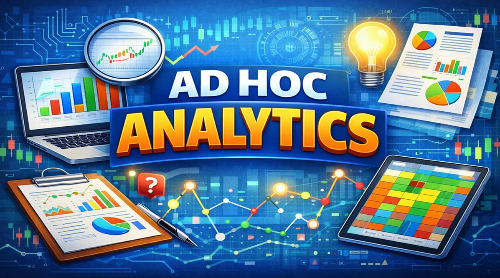

# -AtliQ-Hardwares-Ad-Hoc-Analysis-SQL-Project
## Project Overview This project uses **SQL queries** to explore and analyze consumer goods data. The main goal is to answer **ten specific business questions** and uncover insights that help in making better business decisions.

## Project Goals
- Write SQL queries to answer ad hoc business questions.  
- Analyze sales, inventory, and performance metrics for consumer goods.  
- Extract useful insights to support strategic decision-making.  

## Dataset
The dataset contains information about AtliQ Hardwares’ consumer goods, including:
- Product details  
- Sales and revenue data  
- Inventory and stock levels  
- Retailer and sales channel information  

## Key Insights
- **Increase in Products:** 334 unique products in 2021 vs 245 in 2020.  
- **Top Product Segment:** "Notebook" is the largest segment with 129 products.  
- **Growth in Accessories:** 34 more products in the "Accessories" segment in 2021.  
- **Top Retailer:** "Flipkart" has the highest average pre-invoice discount at 30.83%.  
- **Sales Improvement:** March and April sales improved significantly in 2021 compared to 2020.  
- **Key Sales Channel:** The "Retailer" channel contributed 73.22% of gross sales.

  ## Tools Used
- Microsoft Excel
- MYSQL

---

## Purpose of This Project
This project is created for **learning, practice, and portfolio demonstration**.  
All data used is **sample or anonymized** and does not represent real company data.

---

## Author
**[Prasad Pawar]**  
P&L Reporting | Finance Reporting  

